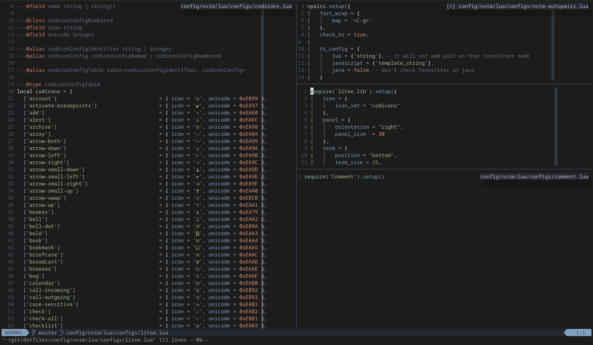

# Buffertag



Buffertag is a very simple plugin which always shows the buffer name in non-focused
windows.

This is designed to be used with the `set laststatus=3` configuration which removes
the unnecessary status lines on each window.

This idea came from enjoying the space saving of `set laststatus=3` but missing
the ability to quickly reference which buffers are in which windows. I split 
hard, and I split often. 

# Usage

## Include in Vim Plug (or your package manager of choice)
```
Plug 'ldelossa/buffertag'
```

## Call setup with an optional config
```
lua require('buffertag').setup({
    -- accepts any border options that `nvim_open_win` accepts.
    -- see ":help vim.api.nvim_open_win"
    border = "none",
    -- By default if the buffer name is too wide for the pane it's in, it will
    -- display and overlap the pane. By setting this to true, the buffer name will
    -- be truncated to fit within the pane, ensuring the floating window does not
    -- overlap any other panes.
    limit_width = false,
})
```

## Toggle it on and off
```
: BuffertagToggle
```

# Demo

Checkout the demo video [here](https://youtu.be/NhhsLYnYjRU)
